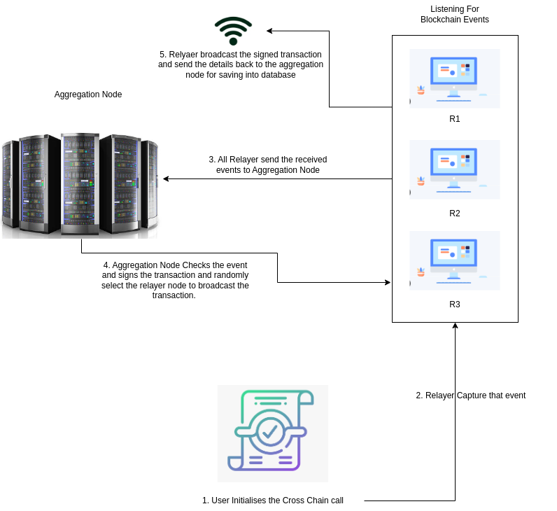

# Cross-Chain Messaging System: Problem and Solution

## Watch the Demo

Check out our demo video on [YouTube](https://www.youtube.com/watch?v=VEZaPk9elX8).

### Problem Statement
In the rapidly evolving landscape of blockchain technology, there is a growing interest in creating decentralized games that leverage the unique features of different blockchain networks. However, a significant challenge arises when a game developed on one blockchain (referred to as "X" Blockchain) needs to be accessed and played by users on other blockchains (referred to as "A," "B," and "C" Blockchains).

Currently, there is no standardized mechanism for ensuring that users on different blockchains can interact with and play a game created on a separate blockchain seamlessly. This fragmentation limits the game's reach and usability, confining it to users on the original blockchain and preventing wider adoption and engagement.

To address this issue, we propose the development of a cross-chain interoperability solution that allows users on Blockchains A, B, and C to access and play the game created on Blockchain X.

The objective is to design and implement a robust cross-chain relayer system to facilitate secure and efficient message transmission between various blockchain networks. The system will support six testnet blockchains: Theta Network, Sepolia, Arbitrum, Polygon Amoy, Base, and Gnosis Chiado. This relayer network aims to address the complexities of cross-chain communication, ensuring reliable and secure transactions across different blockchain environments. However, several challenges need to be addressed to achieve this goal effectively.

#### Interoperability Challenges
Cross-chain communication involves interacting with multiple blockchains, each with its own protocol and data structures. This diversity makes it challenging to achieve seamless interoperability between different networks, requiring standardized solutions to facilitate communication.

#### Security Concerns
Ensuring the security of cross-chain messages is critical. Messages must be protected from unauthorized access and tampering. Without robust security measures, there's a risk of malicious actors intercepting or altering messages, potentially leading to significant vulnerabilities.

#### Scalability Issues
As the number of cross-chain transactions increases, maintaining system performance and efficiency becomes more challenging. High transaction volumes can lead to bottlenecks and delays if the system is not designed to handle scalability effectively.

#### Network Fees
Cross-chain transactions often involve multiple network fees, including fees for sending messages and executing transactions on different chains. Managing and minimizing these costs while ensuring efficient transaction processing is a significant challenge.

### Solution: Relayer Network
To address these challenges, the proposed solution is a relayer network with the following components:

`Relayer Nodes`: Multiple nodes listen for cross-chain events from the on-chain contract. They relay these events to the aggregation node, improving scalability and resilience.

`Aggregation Node`: This node receives messages from relayer nodes, signs transactions, and authorizes them before passing the signed transactions to a randomly selected relayer node.

`Selected Relayer Node`: The selected node broadcasts the signed transaction to the respective blockchain, ensuring the message is delivered accurately.

The relayer system will comprise multiple decentralized relayer nodes, each responsible for listening to specific events on the source blockchain and triggering corresponding actions on the destination blockchain. These nodes should operate concurrently and independently to ensure scalability and fault tolerance. The system must be capable of handling high transaction volumes and should be designed to minimize latency and optimize performance.

In addition to basic message relaying, the system should include mechanisms for error handling, and logging to ensure transparency and traceability of transactions. It must also provide an interface for monitoring and managing the relayer nodes, enabling administrators to track the status and performance of the relayer network. The design should be flexible to accommodate future enhancements, such as support for additional blockchain networks or advanced message filtering and processing capabilities.

This network architecture enhances security, scalability, and coordination in cross-chain messaging while managing network fees more effectively.

##### Quicklinks (Order to run app):
- Run the docker-compose file in root dir for mongodb.
- [Smart Contracts code Explnation](./smartcontracts/README.md)
- [Aggregation Node](./relayers/aggregation-node/README.md)
- [Relayers Node](./relayers/relayer-node/README.md)
- [Game Server](./tgw/server/README.md)
- [Game UI](./tgw/ui/README.md)
- [Sample Game Server](./games/server/README.md)
- [Sample Game UI](./games/tic-tac-toe/README.md)

##### Note:
- During testing, Aggregation node and Relayer node are not running means, cross chain functions won't work, still single chain functionalities continues to work.
- During testing, the game and nfts shown in demo video will not be shown, because, Edge storage node is running locally. So please create new game and new nft items.
- When running Relayer node, there may be a chance of error like 'filter not found error', try to stop that and start again or, anyway it continues to work after sometimes

#### Testnet Contract Addresses

| Testnet  | Coupon Address                                | Contribution Address                          | NFT Address                                  | Games Address                                | NFT Lending Address                          | OffChain Address                             | FeeCollector Address                         | OnChain Address                              | Messaging Address                            |
|----------|-----------------------------------------------|-----------------------------------------------|---------------------------------------------|---------------------------------------------|---------------------------------------------|---------------------------------------------|---------------------------------------------|---------------------------------------------|---------------------------------------------|
| Gnosis   | 0xFb1409344A636F6f9d40eE20473743b42Db142D9    | 0x34ACE2F0cfeB0d3741B7dAC5F013c72cd580cebc    | 0x3496b0a8809E8a8f2277a7073154fF1e85514c1D  | 0xb5F68EB4baD78B050DB55DCb02FCC30815B477ea  | 0x20F1f6104FAC6eA8b38C6f1e0ed06df35716553a  | 0x66610Ed3C3CfD75d6e49d92AEaf258D9D2FC78DE  | 0x34072c72Fd0932F327976d55F030E9aD80799329  | 0xAC0C8Aa0324E4d4ff1170ba4291C17684B4E7ecE  | 0x00c07E165A65B0132f5FF263363A2FcB80E060aA  |
| Amoy     | 0xF1b35AE8250eC1901b04b25649db3938F0C8dfe1    | 0x174Dc96A7Db75119784076f083904Ff531FA2910    | 0x405cbdbA7C7F006AE9fC5ad952b2d3DDd2aeb0E9  | 0x07F539B5cCF429EB1490BF404904c066d41b66A4  | 0x268765515F08E1a9869C07C27eBefD4E69048884  | 0xC463BD08bb40D9e0a0F3c7B1c9Ad24754BAd8A23  | 0xAb7b97D145191a3360cbcd6f78f9a99C6b53C23B  | 0xD88Faf7A4107587d8D9859d5209ce75419482689  | 0x635Bbb2D4b5fa6eb2D303a2af72624f22cfE7FD4  |
| Arbitrum | 0x3A8dd6cD875fFeA174503Bf89Bbd4962643329DD    | 0xE0bB71aE2445C79eEeaCF540D2503D4819E6e10b    | 0x0B0B5939eFe118519c1608f31102d7DCbBb42831  | 0xFA10087fA507dbED5A1e28dD26F1c75BC695cF58  | 0x0a03B32fB6E71D6c92aCD1BE5c3f0c5C4082545f  | 0x600EBB34840a167F4a6ab17e32DA899687a3a79a  | 0x7Bb165B7D69485A520984EE7369d410e8f7260E2  | 0xe54627cC49699B15698d4D80721d8ea61bFF992e  | 0xce88047d4F74e94eBB850589eb6b43505e99e8fd  |
| Base     | 0x82874Aa6db451459739396f3d340E06baf5aDfE6    | 0x2A48a2504b6831e86A89991Cf71AFD8574f8383e    | 0x92530cCBA6E15866EE2f9E9df9bBcbeCADeB4243  | 0xf8974fd417cDcC9d5Cadf61F35228a18D7784bF0  | 0x495B97AA35dC152C63662640B1A9e34C261f4cda  | 0xD9A377f073E0DF0BEC7F94Cf718bB7ff5d824A34  | 0x9D37c91A7bd18EC6f72128D0730e734a792b6377  | 0x0098b9724C595D76B032a9D5B01b5D1d7Bc34Fb3  | 0x3A8dd6cD875fFeA174503Bf89Bbd4962643329DD  |
| Sepolia  | 0xE0bB71aE2445C79eEeaCF540D2503D4819E6e10b    | 0x0B0B5939eFe118519c1608f31102d7DCbBb42831    | 0xFA10087fA507dbED5A1e28dD26F1c75BC695cF58  | 0x0a03B32fB6E71D6c92aCD1BE5c3f0c5C4082545f  | 0x600EBB34840a167F4a6ab17e32DA899687a3a79a  | 0x7Bb165B7D69485A520984EE7369d410e8f7260E2  | 0xe54627cC49699B15698d4D80721d8ea61bFF992e  | 0xce88047d4F74e94eBB850589eb6b43505e99e8fd  | 0x64371f372D372315c56C6E09Cb8aC230dc365B48  |
| Theta    | 0x991Ee2Ad6400e2C7681fa052bEe20900e6368b9D    | 0x65C525da23480144aB86FeD969Fe121880BdcFBd    | 0x7FBf88EB6c04faBcbCDC0E1BD96888d7C27353Cc  | 0x8506FcE859341A2BF20a9d5B62Ea8e6784C2cdC9  | 0x4650F931A1b0a7B9EA8e8933e5Cc5c1CF260272F  | 0x3504a02093096D5a6Be2B6Cf38F039613F1eFe6D  | 0x7a9F0c075DF9D6b94AD61b12BB219F12Ca9c1A68  | 0xfCDBed330007f3ae4957C7089793CE62f63A87f9  | 0xD3e01e843FDE41590CDf4ded06A987C353d6aCA1  |

- Currently our relayer service support 6 blockchains.

## Features of Our Applications:

- Mint NFT on same chain as well as target chain.
- Create Game on same chain as well as target chain.
- You can buy both NFT and Game from your own chain without having the target chain crypto, relayer network takes care of that. You can pay the crypto in your own blockchain crypto.
- Relayer network have **network fee of 0.0001** of respective blockchain crypto. As of now it is static.
- We can teleport NFT from One blockchain to another blockchain.
- We can rent our NFT on same chain.
- All the assets are stored in Theta Edgestore.
- Livestream our playtime using the Theta livestream feature.
- We have the feautre of recorded video to upload in Theta Video API, so that every users on platform can watch.

## About Edge Server:
- Game developers can develop their game and deploy to any other cloud services.
- Theta Game World provides Edge Servers which is used to host games and servers. By Natively, Edge storage have the permanant CDN delivery. We are utilizing that.
- Frontend or Backend .zip files are uploaded to Edge storage, and after that it is running in docker container.

## How Relayer Network runs?
- It only runs, whenever there is a strong and flow contribution towards our relayer network. 
- Initially, Admin can have some fund to start the nodes. Afterwards, it purely depends on **Gaming Community peoples and Game Enthusiasts**.
- If they actively participating in the contribution, then the platform can run throughout.
- If Gamers contribute, they will be rewarded with coupons, which can be withdrawable or used to buy the NFTs.
- It is like the **Liquidity Market**, if liquidity becomes less, then trading will be difficult, likewise, if Contribution becomes nil, then cross chain transaction will be more difficult. But still, same chain functions remain work intact.

## Challenges faced:
- Implementing the cross chain relayer is much challenging and I faced lot of challenge to complete.
- Sometimes, we can't send the signed transaction to the Theta blockchain, since it throws error like `Transaction already seen` with some error code.
- Since, I am running multiple servers, I cannot deploy on the cloud, and I am not much more knowledgeable in cloud part. So, I embedded my private keys into .env files. 
